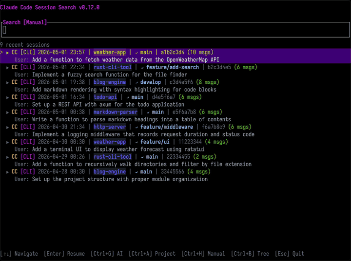

# ccs

A TUI and CLI tool for searching and browsing Claude Code and Claude Desktop session history.

Built with Rust using [ratatui](https://github.com/ratatui/ratatui) and [ripgrep](https://github.com/BurntSushi/ripgrep).



## Features

- **Recent sessions on startup** — shows your most recent sessions with first user message as summary when the TUI launches
- **Full-text search** across all Claude Code CLI and Claude Desktop sessions
- **Regex search** mode (toggle with `Ctrl+R`)
- **Session grouping** — results grouped by session with timestamps and project context
- **Tree view** — visualize conversation branches, forks, and context compactions (`Ctrl+B`)
- **Session resume** — press `Enter` to resume any session directly from search results or the recent sessions list
- **Async search** — non-blocking background search with debounce
- **CLI mode** — `search` and `list` subcommands with JSONL output for scripting
- **Picker mode** — `ccs pick` subcommand for machine-readable session selection (key-value output)
- **Overlay mode** — `ccs --overlay` resumes sessions as child processes, returning to TUI after exit
- **Claude Code plugin** — built-in plugin with overlay picker for session resume from Claude Code
- **Cross-platform** — supports both Claude Code CLI (`~/.claude/projects`) and Claude Desktop sessions

## Installation

### Homebrew (macOS/Linux)

```bash
brew install materkey/ccs/ccs
```

### Shell installer (macOS/Linux)

```bash
curl --proto '=https' --tlsv1.2 -LsSf https://github.com/materkey/ccfullsearch/releases/latest/download/ccfullsearch-installer.sh | sh
```

### Cargo

```bash
cargo install ccfullsearch --locked
```

### Cargo binstall

```bash
cargo binstall ccfullsearch
```

### Requirements

[ripgrep](https://github.com/BurntSushi/ripgrep) (`rg`) must be installed and available in `PATH`. The Homebrew formula installs it automatically.

## Architecture

```
src/
├── lib.rs              # Crate root — re-exports all modules
├── main.rs             # CLI entry point (clap) + TUI event loop
├── cli.rs              # Non-interactive search/list commands (JSONL output)
├── session.rs          # Shared JSONL parsing primitives (timestamps, UUIDs, sources)
├── recent.rs           # Recent sessions: parallel scanning, summary extraction, RecentSession struct
├── search/             # Ripgrep integration, message parsing, result grouping
├── tree/               # Session DAG parsing, branch detection, flattened tree rows
├── resume/
│   ├── path_codec.rs   # Claude path encoding/decoding + filesystem walking
│   ├── fork.rs         # Branch chain detection + fork file creation
│   └── launcher.rs     # Process launching (exec on Unix, spawn on Windows)
└── tui/
    ├── state.rs         # App struct, constructor, input/cursor methods, tick loop
    ├── search_mode.rs   # Search navigation, enter, toggle, search orchestration
    ├── tree_mode.rs     # Tree mode enter/exit, navigation, file lookup
    ├── render_search.rs # Search & preview rendering (+ recent sessions empty state)
    └── render_tree.rs   # Tree mode rendering

tests/
├── fixtures/           # Representative JSONL session files
├── cli_search.rs       # Integration tests for `ccs search`
├── cli_list.rs         # Integration tests for `ccs list`
├── tree_parsing.rs     # Tree parsing via library API
├── resume_resolution.rs # Resume session resolution tests
└── render_snapshots.rs # TUI render state verification
```

## Testing

```bash
# Run all tests
cargo test

# Quality checks (same as CI)
cargo fmt --check
cargo clippy --all-targets --all-features -- -D warnings
cargo test
```

## Usage

### Interactive TUI

```bash
# Launch — shows recent sessions on startup, start typing to search
ccs

# Open tree view for a specific session
ccs --tree <session-id-or-path>
```

### CLI mode

```bash
# Search sessions (outputs JSONL)
ccs search "docker build" --limit 10

# Search with regex
ccs search "OOM|OutOfMemory" --regex

# List all sessions sorted by last activity
ccs list --limit 20
```

### Picker mode

Pick a session interactively and output its info in key-value format. Designed for scripting and tool integration.

```bash
# Pick a session (outputs to stdout)
ccs pick

# Pick with a pre-filled query
ccs pick "docker"

# Write output to a file instead of stdout
ccs pick --output /tmp/session.txt
```

Output format (exit code 0 on selection, 1 on cancel):

```
session_id: abc-123
file_path: /path/to/session.jsonl
source: CLI
project: my-project
```

### Overlay mode

Resume sessions as child processes instead of replacing the TUI process. After exiting Claude, you return to the TUI to pick another session.

```bash
# Launch TUI in overlay mode
ccs --overlay
```

## Keybindings

### Recent sessions (empty input)

| Key | Action |
|-----|--------|
| `Up` / `Down` | Navigate recent sessions |
| `Enter` | Resume selected session |
| `Ctrl+B` | Open tree view for selected session |
| Type | Start searching (recent list disappears) |

### Search mode

| Key | Action |
|-----|--------|
| Type | Search query input |
| `Up` / `Down` | Navigate session groups |
| `Left` / `Right` | Navigate matches within a group |
| `Tab` | Expand/collapse match list |
| `Enter` | Resume selected session |
| `Ctrl+A` | Toggle project filter (current project / all sessions) |
| `Ctrl+V` | Toggle preview (same as Tab) |
| `Ctrl+C` | Clear input (or quit if input is empty) |
| `Ctrl+R` | Toggle regex search mode |
| `Ctrl+B` | Open tree view for selected session |
| `Esc` | Quit |

### Tree mode

| Key | Action |
|-----|--------|
| `Up` / `Down` | Navigate messages |
| `Left` / `Right` | Scroll content horizontally |
| `Tab` | Jump to next branch point |
| `Enter` | Resume session at selected message |
| `Ctrl+C` / `b` / `Esc` | Back to search |
| `q` | Quit |

## Claude Code Plugin

The repo includes a [Claude Code plugin](.claude-plugin/) with a skill for searching and resuming sessions. The plugin supports two modes:

- **CLI mode** — `ccs search` and `ccs list` for non-interactive use
- **Overlay picker mode** — opens a TUI overlay popup (tmux/kitty/wezterm) to pick a session, then offers to resume it

To install, add the plugin path to your Claude Code settings or symlink:

```bash
# The plugin is auto-discovered from the repo's .claude-plugin/ directory
```

Then Claude will use `ccs` when you ask things like "find where we discussed docker", "list my recent sessions", or "resume a previous conversation".

## Releasing

1. Bump `version` in `Cargo.toml`
2. Commit and push to `main`
3. Publish to crates.io: `cargo publish`
4. Tag and push: `git tag v<VERSION> && git push origin v<VERSION>`

The tag push triggers [cargo-dist](https://github.com/axodotdev/cargo-dist) which:
- Builds binaries for macOS (arm64/x86_64) and Linux (gnu/musl, arm64/x86_64)
- Creates tar.gz archives with SHA256 checksums
- Publishes a GitHub Release with all artifacts
- Updates the Homebrew formula in [materkey/homebrew-ccs](https://github.com/materkey/homebrew-ccs)

## How it works

1. Searches JSONL session files using `ripgrep` for speed
2. Parses matched lines as Claude session messages (user, assistant, tool calls)
3. Groups results by session with metadata (project name, timestamps)
4. Tree view parses the full session DAG to show conversation branches and the latest chain
